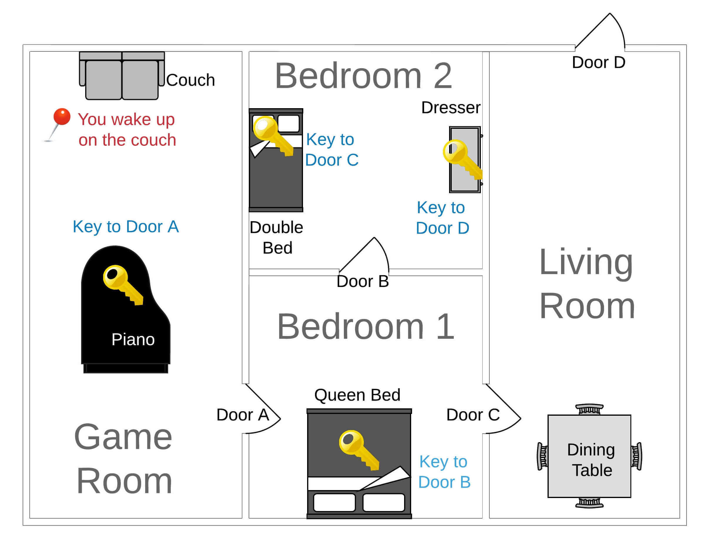

# Escape_Room_Game_by_Python

## The Game
Deliver a main.ipynb file with your Python game solution and the .py file(s) containing your functions. It should reflect the Python concepts learned each day and be pushed to GitHub. You may download the files from the Google Colab and push these. The end product should be fully functional but also well-structured, efficient, robust, and entertaining!

Here is a checklist of deliverables for the quest that you can refer to throughout the week to make sure you are on track:

* The game incorporates various data structures, specifically dictionaries and lists, to define game rooms, paths, and items.
* The game uses a Python dictionary to store the game state which is updated when progress is made, such as a key being collected.
* Flow control (if, elif, else statements) has been utilized to create game logic, for example, to determine what happens when a player makes certain choices or interacts with game items.
* The code appropriately uses loops where needed, such as for repeating game actions until the player reaches a certain outcome.
* The game uses functions to play the game and compartmentalize tasks such as navigating between rooms or interacting with items.
* Arguments are used in functions where appropriate to allow for reusability.
* The game uses return statements in functions to output certain results, which are then used elsewhere in your code.
* After completing each game action, functions are called to continue playing until the winning condition is reached.
* The game utilizes comprehension for creating more efficient and readable code where applicable.
* Any user input is validated and the game incorporates error handling techniques to handle any possible errors or exceptions, providing a smoother user experience.
* The code is well-documented with comments explaining what different sections of the code are doing. Functions are properly documented as well following docstring good practices.
* The game has a clear end goal or “win” condition that the player can achieve (making it “Outside”).

# Game Structure:

